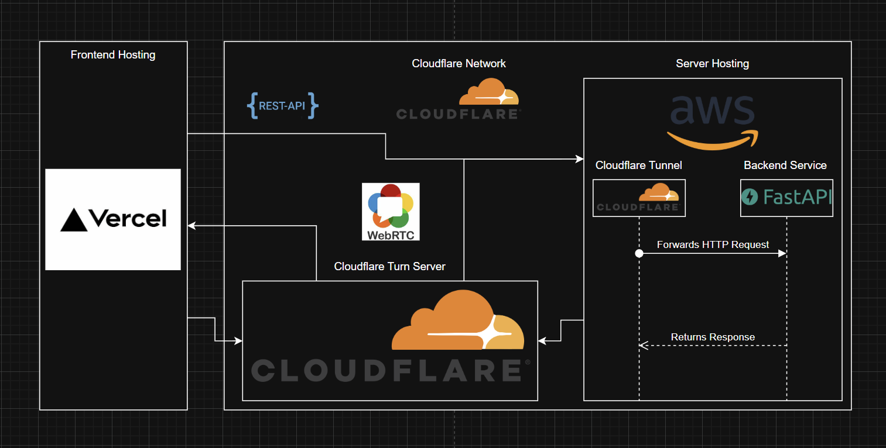
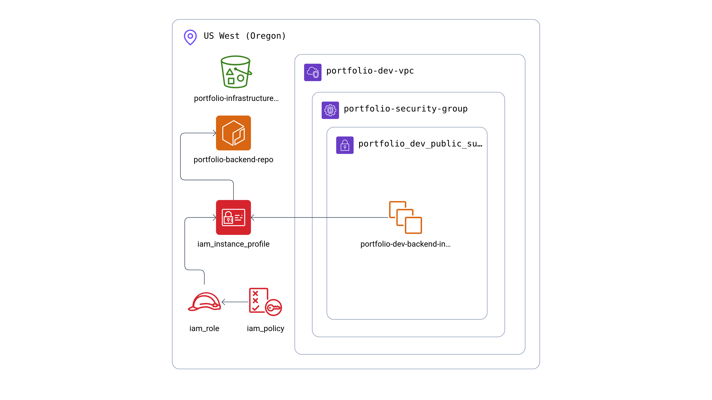

# Portfolio Infrastructure

This repository contains the infrastructure as code (IaC) for my Portfolio, implemented using Terraform and deployed on Amazon Web Services (AWS). The infrastructure supports a voice agent application built with FastAPI, FastRTC, WebRTC, and LangGraph, with the backend deployed on EC2 and exposed through Cloudflare tunnel.

## 🏗️ Architecture Overview

The portfolio infrastructure follows a modern cloud-native architecture:

- **Frontend**: Deployed on Vercel for optimal performance and global CDN
- **Backend**: Deployed on AWS EC2 with Docker containerization
- **WebRTC**: Utilizes Cloudflare TURN Server for voice agent functionality
- **Networking**: Cloudflare tunnel for secure backend access
- **Container Registry**: AWS ECR for Docker image management




## 📁 Repository Structure

```bash
portfolio-infrastructure/
├── assets/                          # Architecture diagrams and images
│   ├── portfolio-cloud-architecture.png
│   └── portfolio-aws-architecture.png
├── environments/                    # Environment-specific configurations
│   └── dev/                        # Development environment
│       ├── main.tf                 # Main Terraform configuration
│       ├── variables.tf            # Variable definitions
│       ├── secrets.tfvars          # Secret variables (not in git)
│       ├── outputs.tf              # Output values
│       ├── providers.tf            # Provider configurations
│       ├── versions.tf             # Terraform and provider versions
│       ├── ec2-setup.sh            # EC2 instance setup script
│       ├── portfolio-backend/      # Backend application configs
│       │   └── docker-compose.yml  # Docker Compose configuration
│       └── backend/                # Backend module configuration
├── modules/                        # Reusable Terraform modules
│   └── providers/
│       └── aws/
│           ├── backend/            # EC2 instance and setup
│           ├── ecr/                # Elastic Container Registry
│           ├── iam/                # Identity and Access Management
│           ├── network/            # VPC, subnets, and networking
│           └── security-group/     # Security group configurations
└── README.md                       # This file
```

## 🧩 Terraform Modules

### **Network Module** (`modules/providers/aws/network/`)

- **VPC**: Creates a custom VPC with CIDR `10.0.0.0/16`
- **Public Subnets**: Two public subnets across different AZs (`10.0.1.0/24`, `10.0.2.0/24`)
- **Internet Gateway**: Enables internet access for public subnets
- **DNS Support**: Enables DNS hostnames and support for proper name resolution

### **Security Group Module** (`modules/providers/aws/security-group/`)

- **WebRTC Ports**: UDP ports 10000-20000 for media traffic
- **STUN/TURN Signaling**: Ports 3478 (UDP/TCP) and 5349 (TCP) for TURN over TLS
- **SSH Access**: Port 22 for secure shell access
- **Cloudflare Tunnel**: Specific egress rules for Cloudflare tunnel communication

### **Backend Module** (`modules/providers/aws/backend/`)

- **EC2 Instance**: Amazon Linux 2 with t3.micro instance type
- **Key Pair Management**: Automatic SSH key generation and storage
- **IAM Profile**: Instance profile for ECR access
- **Provisioning**: Automated setup with Docker, Docker Compose, and Cloudflared
- **File Deployment**: Copies docker-compose.yml to `/home/ec2-user/portfolio-backend/`

### **ECR Module** (`modules/providers/aws/ecr/`)

- **Container Registry**: Private ECR repository for Docker images
- **VPC Integration**: Repository configured within VPC
- **Lifecycle Policies**: Automatic cleanup of old images

### **IAM Module** (`modules/providers/aws/iam/`)

- **ECR Access**: IAM role for EC2 instances to pull from ECR
- **Least Privilege**: Minimal permissions for security

## 🚀 Setup Instructions

### Prerequisites

1. **Terraform** (v1.0+)

   ```bash
   # Download from https://www.terraform.io/downloads.html
   # Or use package manager
   brew install terraform  # macOS
   choco install terraform # Windows
   ```

2. **AWS CLI** (v2.0+)

   ```bash
   # Download from https://aws.amazon.com/cli/
   # Or use package manager
   brew install awscli     # macOS
   choco install awscli    # Windows
   ```

3. **Git** (for cloning the repository)

### AWS CLI Profile Setup

1. **Configure AWS CLI with your credentials**:

   ```bash
   aws configure --profile portfolio
   ```

2. **Enter your AWS credentials**:

   ```bash
   AWS Access Key ID: [Your Access Key]
   AWS Secret Access Key: [Your Secret Key]
   Default region name: us-west-2
   Default output format: json
   ```

3. **Verify the profile**:

   ```bash
   aws sts get-caller-identity --profile portfolio
   ```

### Environment Configuration

1. **Navigate to the development environment**:

   ```bash
   cd environments/dev
   ```

2. **Create/Update `secrets.tfvars`**:

   ```hcl
   project_name = "portfolio"
   env_name     = "dev"
   BACKEND_KEY_PAIR_PATH = "path/to/your/key-pair.pem"
   ```

   **Note**: Replace `BACKEND_KEY_PAIR_PATH` with the actual path where you want to store the SSH key pair.

3. **Initialize Terraform**:

   ```bash
   terraform init
   ```

4. **Plan the deployment**:

   ```bash
   terraform plan -var-file=secrets.tfvars
   ```

5. **Apply the infrastructure**:

   ```bash
   terraform apply -var-file=secrets.tfvars
   ```

### Post-Deployment

After successful deployment:

1. **SSH into the EC2 instance**:

   ```bash
   ssh -i path/to/your/key-pair.pem ec2-user@<EC2_PUBLIC_IP>
   ```

2. **Verify Docker and Cloudflared installation**:

   ```bash
   docker --version
   cloudflared --version
   ```

3. **Check the portfolio-backend directory**:

   ```bash
   ls -la /home/ec2-user/portfolio-backend/
   ```

## 🔧 Infrastructure Features

### **WebRTC Support**

- **STUN/TURN Configuration**: Properly configured security groups for WebRTC traffic
- **Port Ranges**: UDP ports 10000-20000 for media, ports 3478/5349 for signaling
- **Cloudflare Integration**: TURN server integration for voice agent functionality

### **Security**

- **Security Groups**: Restrictive ingress/egress rules
- **IAM Roles**: Least privilege access to AWS services
- **SSH Key Management**: Automated key pair generation and secure storage

### **Scalability**

- **Multi-AZ Deployment**: Resources spread across availability zones
- **Container Registry**: ECR for efficient image management
- **Modular Design**: Reusable Terraform modules for different environments

### **Monitoring & Maintenance**

- **Docker Compose**: Container orchestration for easy deployment
- **Cloudflared Tunnel**: Secure, zero-trust access to backend services
- **Automated Setup**: EC2 instance provisioning with all necessary tools

## 🛠️ Troubleshooting

### Common Issues

1. **STUN Transaction Failed (401)**:
   - Check security group rules for WebRTC ports
   - Verify Cloudflare tunnel configuration
   - Ensure proper network mode in Docker Compose

2. **EC2 Connection Issues**:
   - Verify SSH key permissions (`chmod 400 key.pem`)
   - Check security group allows SSH (port 22)
   - Ensure instance is in a public subnet

3. **Docker Issues**:
   - Verify Docker service is running: `sudo systemctl status docker`
   - Check Docker Compose installation: `docker-compose --version`

## 📝 Notes

- The infrastructure is designed for development environment (`dev`)
- All sensitive information should be stored in `secrets.tfvars` (not committed to git)
- The EC2 instance uses Amazon Linux 2 with automatic updates
- WebRTC configuration is optimized for voice agent applications
- Cloudflare tunnel provides secure access without exposing public endpoints

## 📄 License

This project is part of my personal portfolio infrastructure.
